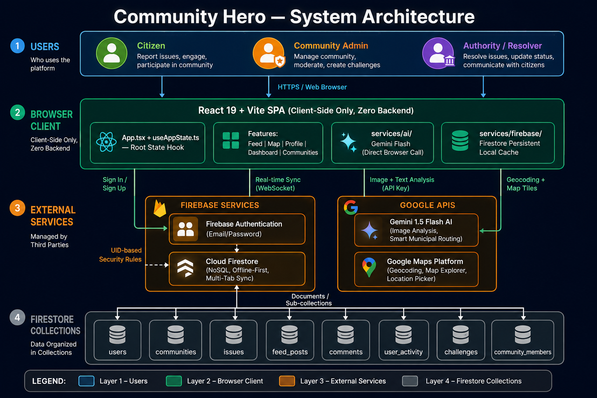

# 🛡️ Community Hero — Social Civic Platform

**Community Hero** is a modern, social civic platform built to empower citizens, community leaders, and local authorities to flag, verify, and resolve hyperlocal issues. Moving away from standard, dry administrative dashboards, Community Hero is designed like a social network (inspired by Facebook feeds, Reddit threads, and Discord communities) to foster engagement, community cohesion, and citizen-led neighborhood auditing.

---

## 🚀 The Innovative Approach & Architecture

### 1. Zero-Cost Serverless Frontend Architecture
We have completely removed the traditional Node.js backend server. The application runs entirely as a serverless static client that communicates directly with:
* **Firebase Firestore** for database persistence, real-time updates, and authentication.
* **Google Gemini AI API** directly from the browser for visual diagnostics and scan verification.

This architecture enables **instant loading times**, scales to millions of users at **zero hosting cost**, and can be deployed directly to static hosts like **Google Cloud, Firebase Hosting, Vercel, or Netlify**.

### 2. Client-Side Gemini AI Diagnostics (`@google/genai`)
Instead of manual verification or routing images through a backend, we use the official `@google/genai` SDK directly inside the user's browser.
* **Visual & Contextual Auditing**: When a citizen uploads a photo of a pothole, leaking pipe, or garbage pile, Gemini 3.5 Flash scans the image and text in real-time.
* **Automated Classification**: Gemini refines the category, estimates severity/risk levels, writes a professional summary of the incident, and calculates a **Priority Score (0-100)**.
* **Smart Municipal Routing**: Gemini automatically maps the issue to the correct municipal department (e.g. *Public Works*, *Waste Management*, *Water Supply*) to streamline resolution.
* **Resilient Simulation Mode**: If no Gemini API key is configured, the service gracefully switches to local simulation logic, allowing offline testing and sandboxing.

### 3. Reactive State Management & Multi-Tab Synchronization
* **Single Hook Architecture**: Rather than scattering state across components, we manage the entire client lifecycle via a unified React hook (`src/app/useAppState.ts`).
* **Offline-First Cache**: Utilizing Firestore's `persistentLocalCache` and `persistentMultipleTabManager`, the application is fully responsive offline and automatically synchronizes updates across multiple open browser tabs.

### 4. Civic Gamification Engine
To incentivize citizen participation, Community Hero implements a lightweight gamification system:
* **XP and Leveling**: Users earn XP for reporting issues, casting verification votes, commenting, and resolving incidents. Citizen levels range from *Citizen* to *Civic Hero* and *Guardian*.
* **Badges**: Citizens earn badges for milestones such as *First Report*, *Water Warrior*, *Cleanliness Champion*, or *Top Verifier*.
* **Civic Champions**: A live leaderboard displaying active communities and top citizens to encourage friendly neighborhood competition.

---

## System Design



---

## App Screenshots


---

## 📂 Project Directory Structure

```text
src/
  ├── app/                  # Application initialization, root components, and global state
  │    ├── App.tsx          # Router, desktop layout sidebar, mobile bottom nav
  │    └── useAppState.ts   # Custom root hook managing Firestore sync, auth, and state
  ├── components/           # Generic UI components
  │    └── layout/          # Landing pages and global wraps
  ├── features/             # Feature-based modular directories
  │    ├── auth/            # Firebase Authentication modal and views
  │    ├── communities/     # Neighborhood groups, spaces list, and membership pages
  │    ├── dashboard/       # Bento-style user dashboard and leaderboard lists
  │    ├── feed/            # Social feed posts, comments cache, likes, and bookmarks
  │    ├── issues/          # Incidents directory and reporting forms
  │    ├── maps/            # OpenStreetMap and Google Maps coordination pickers
  │    └── profile/         # User profiles, badges, comments tracker, and activity history
  ├── services/             # Core service layers
  │    ├── ai/              # Gemini AI client-side connector
  │    └── firebase/        # Firestore persistent local cache setup
  ├── types/                # TypeScript interface declarations
  ├── lib/                  # Local mock datasets and fallbacks
  └── styles/               # Global css styling sheet
```

---

## 🛠️ Installation & Local Development

### Prerequisites
* **Node.js** (v18 or higher recommended)
* **npm** (comes packaged with Node.js)

### 1. Set Up Environment Variables
Create a `.env` file in the root directory and add your keys:
```env
# Google Gemini API Key
GEMINI_API_KEY="your-gemini-api-key-here"

# Google Maps API Key (Optional)
GOOGLE_MAPS_PLATFORM_KEY="your-google-maps-api-key-here"
```

### 2. Install Dependencies
Installs React 19, Vite, Firebase SDK, Tailwind CSS, Lucide icons, and the Google Gen AI client library:
```powershell
npm install
```

### 3. Run the Development Server
Starts the local development server at `http://localhost:5173`:
```powershell
npm run dev
```

### 4. Build for Production
Creates a highly optimized static bundle inside the `dist/` directory:
```powershell
npm run build
```

### 5. Preview Production Build locally
Serves the built static bundle locally:
```powershell
npm run preview
```

### 6. Lint and Type Checking
Verifies TypeScript compilation correctness:
```powershell
npm run lint
```

---

## 🔑 Preset Demo Accounts & Testing

To make evaluation and testing simple, **Community Hero** provides four pre-configured mock user profiles centered around **Chandrapur, Maharashtra**. 

### 1. Simplified Registration
We have removed the **Civic Role** and **Civic Jurisdiction (City)** dropdown inputs from the registration page to ensure a clean, modern user experience. When you sign up a new account, you default to the **Citizen** role and your location defaults to your GPS closest city (or **Chandrapur** if GPS permissions are denied).

### 2. Relocated Civic Settings
You can customize your role and city post-login:
- **Profile Page**: Click **"Edit Profile"** on your profile page to change your Name, Username, Bio, freeform Location, Civic City Jurisdiction, and Civic Role.
- **Settings Page**: Navigate to **Settings** (left sidebar on desktop, bottom navigation on mobile) and select the **Preferences** tab. You can update your Primary City and Civic Role from here.

### 3. Preset Hackathon Accounts
You can log in directly to these pre-configured user credentials (or use the 1-Click Demo Login panel in the login modal):

| Role | Email | Password | Pre-seeded Mock User Profile Details |
| :--- | :--- | :--- | :--- |
| **Community Admin** | `admin@communityhero.net` | `password123` | **Akshay Dhongade**: Admin of *Green Park Society* and *Ward 12* with 1250 XP, 4 badges, and full moderation controls. |
| **Citizen** | `citizen@communityhero.net` | `password123` | **Priya Sharma**: Active resident of *Green Park Society* with 480 XP and 2 badges. |
| **Resolver** | `resolver@communityhero.net` | `password123` | **Rohan Patil**: Municipal technician with 920 XP, *Problem Solver* badge, and permission to update resolved issues. |
| **Authority** | `authority@communityhero.net` | `password123` | **Dr. Suresh Mehta**: Ward 12 Commissioner with 1500 XP, authority audit controls, and *Civic Hero* status. |

> [!TIP]
> **Dynamic Mock Data Mapping**: When you log in with any of these hackathon emails, the app automatically clones their rich mock statistics, activities, and communities onto your active session. After logging in, navigate to **Settings** -> **Preferences** tab and click **"Reset & Seed Sandbox Database"**. This purges the database and links all pre-seeded issues, comments, and notifications directly to your active Firebase UID!
